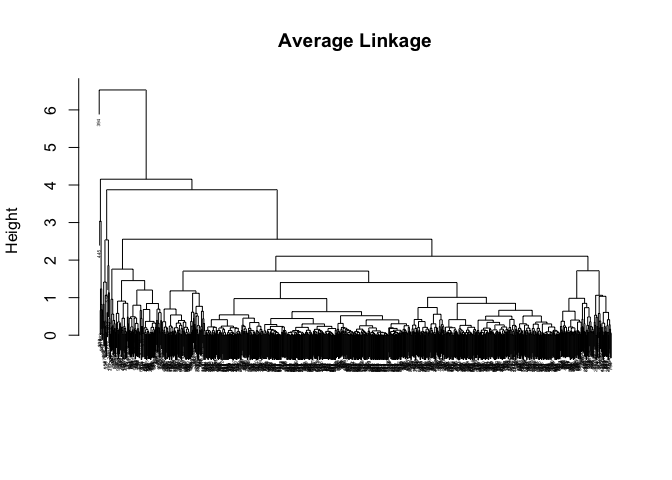

Clustering Tutorial
================
Fan Gong
2017/7/17

Overview
========

Clustering is an unsupervised learning method, it used to discover structure(distinict clusters) on the basis of a data set.

Both clustering and PCA seek to simplify the data via a small number of summaries, but their mechanisms are different:

-   PCA looks to find a low-dimensional representation of the observations that explain a good fraction of the variance.

-   Clustering looks to find homogeneous subgroups among the observations.

In this section we focus on two best-known clustering approaches: `K-means clustering` and `hierarchical clustering`. One seeks to partition the observations into a pre-specified number of clusters, another one we do not know in advance how many clusters we want.

K-means Clustering
==================

K-means clustering defines an optimization problem that minimize the within-cluster variation which is the sum of all pairwise squared Euclidean distance in this cluster.

Algorithm:
----------

1.  Randomly assign a number, from 1 to K, to each of the observations. These serve as initial cluster assignments for the observations.

2.  Iterate until the cluster assignments stop changing:

-   For each of the K clusters, compute the cluster centroid. The kth cluster centroid is the vector of the p feature means for the observations in the kth cluster.

-   Assign each observation to the cluster whose centroid is closest.

Because the K-means algorithm finds a local rather than a global optimum, the results obtained will depend on the initial (random) cluster assignment of each observation in Step 1. For this reason, it is important to run the algorithm multiple times from different random initial configurations.

Implementation in R
-------------------

``` r
library(ggplot2)
attach(diamonds)
diamonds = diamonds[sample(nrow(diamonds), 1000),]
set.seed(1)
head(diamonds)
```

    ## # A tibble: 6 <U+00D7> 10
    ##   carat       cut color clarity depth table price     x     y     z
    ##   <dbl>     <ord> <ord>   <ord> <dbl> <dbl> <int> <dbl> <dbl> <dbl>
    ## 1  2.02   Premium     E     SI2  59.8    58 17825  8.20  8.16  4.89
    ## 2  1.03   Premium     E     SI2  58.8    62  4070  6.58  6.51  3.85
    ## 3  2.00      Good     F     SI1  63.0    61 18376  7.85  7.99  4.99
    ## 4  0.31     Ideal     E     VS1  61.1    54   692  4.37  4.40  2.68
    ## 5  0.51 Very Good     F     VS2  63.2    56  1574  5.10  5.06  3.21
    ## 6  1.51      Fair     F      I1  67.8    59  3734  7.09  7.00  4.78

``` r
km.out = kmeans(diamonds[,c(1,5)], 5, nstart = 20)
#If a value of nstart greater than one is used, then K-means clustering will be performed using multiple random assignments in Step 1 of our Algorithm, and the kmeans() function will report only the best results.
km.out$tot.withinss
```

    ## [1] 485.2408

``` r
#By comparison, we use a lower number of nstart, the total within-cluster sum of squares will become larger.
km.out2 = kmeans(diamonds[,c(1,5)], 5, nstart = 1)
km.out2$tot.withinss
```

    ## [1] 485.2408

``` r
ggplot(data = diamonds, aes(x = carat, y = depth, color = km.out$cluster)) + geom_point(aes(shape = cut))
```


Hierarchical Clustering
=======================

One potential disadvantage of K-means clustering is that it requires us to pre-specify the number of clusters K. Hierarchical clustering is an alternative approach which does not require that we commit to a particular choice of K. Hierarchical clustering has an added advantage over K-means clustering in that it results in an attractive tree-based representation of the observations, called a dendrogram.

Linkage
-------

We have a concept of the dissimilarity between pairs of observations, but how do we define the dissimilarity between two groups? This extension is achieved by developing the notion of linkage, which defines the dissimilarity between two groups of observations.

<table style="width:68%;">
<colgroup>
<col width="16%" />
<col width="51%" />
</colgroup>
<thead>
<tr class="header">
<th>Linkage</th>
<th>Description</th>
</tr>
</thead>
<tbody>
<tr class="odd">
<td>Complete</td>
<td>Maximal intercluster dissimilarity</td>
</tr>
<tr class="even">
<td>Single</td>
<td>Minimal intercluster dissimilarity</td>
</tr>
<tr class="odd">
<td>Average</td>
<td>Mean intercluster dissimilarity</td>
</tr>
<tr class="even">
<td>Centroid</td>
<td>Dissimilarity between centroid for cluster A and the centroid for cluster B</td>
</tr>
</tbody>
</table>

Algorithm
---------

1.  Starting out at the bottom of the dendrogram, each of the n observations is treated as its own cluster. Begin with n observations and a measure (such as Euclidean distance) of all the $(^n\_2)=\\frac{n(n-1)}{2}$ pairwise dissimilarities.

2.  Examine all pairwise inter-cluster dissimilarities among the i clusters and identify the pair of clusters that are most similar. Fuse these two clusters.

3.  Compute the new pairwise inter-cluster dissimilarities among the i-1 remaining clusters.

Implementation in R
-------------------

`hclust` function implements hierarchical clustering in R. The `dist()` function is used to compute the inter-observation Euclidean distance matrix.

``` r
#scale the variables ahead 
df = scale(diamonds[,c(1,5)])

#calculate inter-observation Euclidean distance
distance = dist(df)

hc.complete = hclust(distance, method = "complete")
hc.average = hclust(distance, method = "average")
hc.single = hclust(distance, method = "single")

#Make a plot
plot(hc.complete ,main =" Complete Linkage ", xlab="", sub ="",
cex =.3)
```


``` r
plot(hc.average , main =" Average Linkage ", xlab="", sub ="",
cex =.3)
```



``` r
plot(hc.single , main=" Single Linkage ", xlab="", sub ="",
cex =.3)
```


``` r
#Determine the cluster labels for each observation assiciated with a given cut of the dendrogram
head(cutree(hc.complete, 2))
```

    ## [1] 1 1 1 1 1 2

NCI60 Data Example
==================

Unsupervised techniques are often used in the analysis of genomic data. We illustrate these techniques on the NCI60 cancer cell line macroarray data, which consists of 6830 gene expression measurements on 64 cancer cell lines. Each cell line is labeled with a cancer type.

``` r
library(ISLR)
nci.labs = NCI60$labs
nci.data = NCI60$data
table(nci.labs)
```

    ## nci.labs
    ##      BREAST         CNS       COLON K562A-repro K562B-repro    LEUKEMIA 
    ##           7           5           7           1           1           6 
    ## MCF7A-repro MCF7D-repro    MELANOMA       NSCLC     OVARIAN    PROSTATE 
    ##           1           1           8           9           6           2 
    ##       RENAL     UNKNOWN 
    ##           9           1

PCA
---

We first perform PCA on the data after scaling the variables to have std = 1.

``` r
pr.out = prcomp(nci.data, scale = T )
data = data.frame(cbind(pr.out$x, nci.labs))

#plot first few PC to visualize the data.
Cols = function(vec){
  cols = rainbow(length(unique(vec)))
  return(cols[as.numeric(as.factor(vec))])
}

par(mfrow = c(1,2))
plot(pr.out$x[,1:2], col = Cols(nci.labs), pch = 19)
plot(pr.out$x[, c(1,3)], col = Cols(nci.labs), pch = 19)
```


These plots show that cell lines corresponding to a single cancer type do tend to have similar values on the first few PC score vectors.

``` r
#Plot the PVE of each PC
pve = summary(pr.out)$importance[2,]
plot(pve, type = "o", ylab = "PVE", xlab = "PC", col = "blue")
```


``` r
plot(summary(pr.out)$importance[3,], type="o", ylab =" Cumulative PVE", xlab="Principal Component ", col =" brown3 ")
```


there is an elbow in the plot after approximately the seventh principal component. This suggests that there may be little benefit to examining more than seven or so principal components.

Clustering
----------

### Hierarchically Clustering

We now proceed to hierarchically cluster the cell lines in the NCI60 data, with the goal of finding out whether or not the observations cluster into distinct types of cancer.

``` r
sd.data = scale(nci.data)
distance = dist(sd.data)

#plot to see the difference of three linkage
par(mfrow = c(1,1))
plot(hclust(distance, method = "complete"), labels = nci.labs, cex = 0.6)
```


``` r
plot(hclust(distance, method = "single"), labels = nci.labs, cex = 0.6)
```


``` r
plot(hclust(distance, method = "average"), labels = nci.labs, cex = 0.6)
```


Typically, single linkage will tend to yield trailing clusters: very large clusters onto which individual observations attach one-by-one. On the other hand, complete and average linkage tend to yield more balanced, attractive clusters. For this reason, complete and average linkage are generally preferred to single linkage.

We then cut the dendrogram at the height that will yield a particular number of clusters, say four:

``` r
hc.out = hclust(distance, method = "complete")
hc.clusters = cutree(hc.out, 4)
lab = factor(nci.labs)
table(hc.clusters ,nci.labs)
```

    ##            nci.labs
    ## hc.clusters BREAST CNS COLON K562A-repro K562B-repro LEUKEMIA MCF7A-repro
    ##           1      2   3     2           0           0        0           0
    ##           2      3   2     0           0           0        0           0
    ##           3      0   0     0           1           1        6           0
    ##           4      2   0     5           0           0        0           1
    ##            nci.labs
    ## hc.clusters MCF7D-repro MELANOMA NSCLC OVARIAN PROSTATE RENAL UNKNOWN
    ##           1           0        8     8       6        2     8       1
    ##           2           0        0     1       0        0     1       0
    ##           3           0        0     0       0        0     0       0
    ##           4           1        0     0       0        0     0       0

``` r
par(mfrow =c(1,1))
plot(hc.out , labels =nci.labs, cex = 0.6)
abline (h=139, col =" red ")
```


There are some clear patterns. All the leukemia cell lines fall in cluster 3, while the breast cancer cell lines are spread out over three different clusters.

### k-means

K-means clustering and hierarchical clustering with the dendrogram cut to obtain the same numberof clusters can yield very different results.

``` r
set.seed(2)
km.out = kmeans(sd.data, 4, nstart = 20)
km.clusters = km.out$cluster
table(km.clusters ,hc.clusters)
```

    ##            hc.clusters
    ## km.clusters  1  2  3  4
    ##           1 11  0  0  9
    ##           2  0  0  8  0
    ##           3  9  0  0  0
    ##           4 20  7  0  0

### Using PCs to do clustering

we can simply perform hierarchical clustering on the first few principal component score vectors. Sometimes performing clustering on the first few principal component score vectors can give better results than performing clustering on the full data.

``` r
hc.out.pc = hclust(dist(pr.out$x[,1:2]))
plot(hc.out.pc, labels = nci.labs, cex = 0.6)
```


``` r
table(cutree(hc.out.pc, 4), nci.labs)
```

    ##    nci.labs
    ##     BREAST CNS COLON K562A-repro K562B-repro LEUKEMIA MCF7A-repro
    ##   1      3   5     0           0           0        0           0
    ##   2      1   0     2           0           0        0           0
    ##   3      1   0     5           1           1        6           1
    ##   4      2   0     0           0           0        0           0
    ##    nci.labs
    ##     MCF7D-repro MELANOMA NSCLC OVARIAN PROSTATE RENAL UNKNOWN
    ##   1           0        0     4       1        0     8       0
    ##   2           0        1     5       5        2     1       1
    ##   3           1        0     0       0        0     0       0
    ##   4           0        7     0       0        0     0       0
