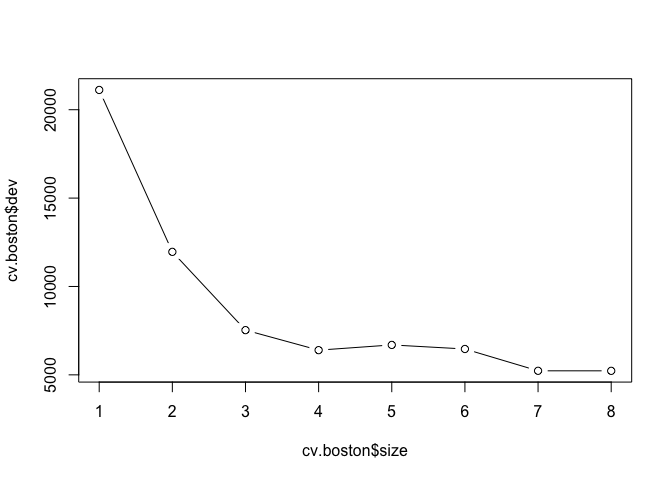
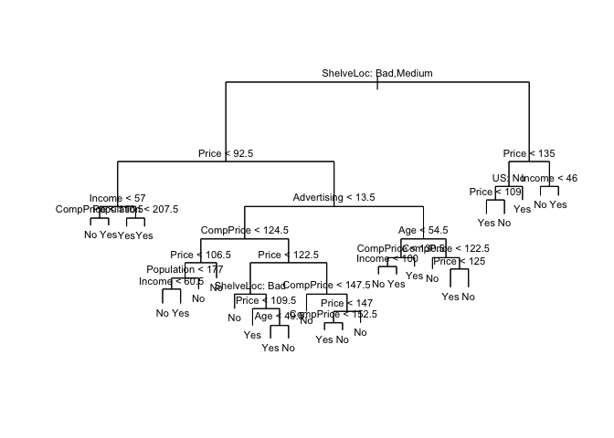
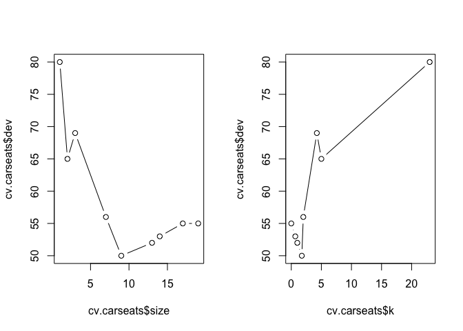
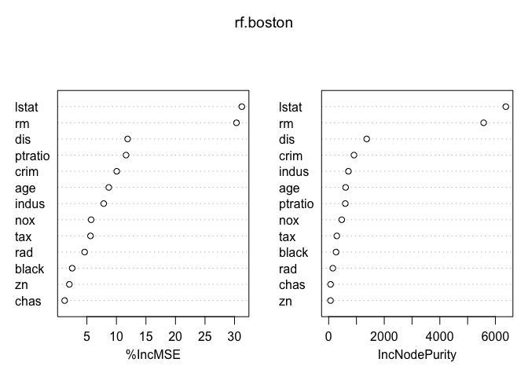
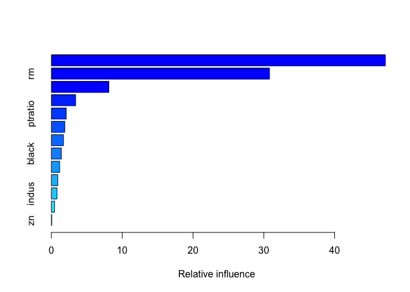

Decision Tree
================
Fan Gong
2017/8/30

Decision Tree
=============

Preview
-------

Tree-based methods are simple and useful for interpretation. However, they typically are not competitive with the best supervised learning approached. Hence we also introduce bagging, random forests, and boosting. Each of these approaches involves producing multiple trees which are then combined to yeild a single consensus prediction. We will see that combining a large number of trees can often result in dramatic improvements in prediction accuracy, at the expense of some loss in interpretation.

The Basics of Decision Trees
----------------------------

Decision trees can be applied to both regression and classification problems.

### Regression Trees

#### Logic Design

The goal is to find boxes *R*<sub>1</sub>, …, *R*<sub>*j*</sub> that minimize the RSS given by
$$\\sum\_{j=1}^{J}\\sum\_{i\\in R\_j}(y\_i-\\hat{y}\_{R\_j})$$
 where $\\hat{y}\_{R\_j}$ is the mean response for the training observations within the *j*th box. However, it is computationally infeasibale, so we take a top-down, greedy approach that is known as recursive binary splitting.

In order to perform recursive binary splitting, we first select the predictor *X*<sub>*j*</sub> and the cutpoint *s* such that splitting the predictor space into regions {*X*|*X*<sub>*j*</sub> &lt; *s*} and {*X*|*X*<sub>*j*</sub> ≥ *s*} leads to the greatest possible reduction in RSS.

Next we repeat this process but this time we split one of the two previously identified regions.

#### Tree Pruning

The process described above may produce good predictions on the training set, but is likely to overfit the data, leading to poor test set performance. This is because the resulting tree might be too complex.

Here we use cost complexity pruning-also known as weakest link pruning-gives us a way to do just this. Rather than considering every possible subtree, we consider a sequence of trees indexed by a nonnegative tunning parameter *α*. For each value of *a**l**p**h**a* there corresponds a subtree *T* ⊂ *T*<sub>0</sub> such that
$$\\sum\_{m=1}^{|T|}\\sum\_{i:x\_i \\in R\_m}(y\_i-\\hat{y}\_{R\_m})^2+\\alpha|T|$$
 is as small as possible. The tunning parameter *α* controls a trade-off between the subtree's complexity and its fit to the training data.

#### Implementation in R

The implementation procudure between regression tree and classification tree is that for regression tree we use `cv.tree(tree, FUN = pruen.tree)`, but for classification tree we use `cv.tree(tree, FUN = pruen.misclass)`

``` r
library(tree)
library(MASS)
set.seed(1)
head(Boston)
```

    ##      crim zn indus chas   nox    rm  age    dis rad tax ptratio  black
    ## 1 0.00632 18  2.31    0 0.538 6.575 65.2 4.0900   1 296    15.3 396.90
    ## 2 0.02731  0  7.07    0 0.469 6.421 78.9 4.9671   2 242    17.8 396.90
    ## 3 0.02729  0  7.07    0 0.469 7.185 61.1 4.9671   2 242    17.8 392.83
    ## 4 0.03237  0  2.18    0 0.458 6.998 45.8 6.0622   3 222    18.7 394.63
    ## 5 0.06905  0  2.18    0 0.458 7.147 54.2 6.0622   3 222    18.7 396.90
    ## 6 0.02985  0  2.18    0 0.458 6.430 58.7 6.0622   3 222    18.7 394.12
    ##   lstat medv
    ## 1  4.98 24.0
    ## 2  9.14 21.6
    ## 3  4.03 34.7
    ## 4  2.94 33.4
    ## 5  5.33 36.2
    ## 6  5.21 28.7

``` r
#Create training data
train = sample(1:nrow(Boston), nrow(Boston)/2)
#Train the data
tree.boston = tree(medv~., Boston, subset = train)
summary(tree.boston)
```

    ## 
    ## Regression tree:
    ## tree(formula = medv ~ ., data = Boston, subset = train)
    ## Variables actually used in tree construction:
    ## [1] "lstat" "rm"    "dis"  
    ## Number of terminal nodes:  8 
    ## Residual mean deviance:  12.65 = 3099 / 245 
    ## Distribution of residuals:
    ##      Min.   1st Qu.    Median      Mean   3rd Qu.      Max. 
    ## -14.10000  -2.04200  -0.05357   0.00000   1.96000  12.60000

``` r
#Prune
cv.boston = cv.tree(tree.boston, FUN = prune.tree)
cv.boston
```

    ## $size
    ## [1] 8 7 6 5 4 3 2 1
    ## 
    ## $dev
    ## [1]  5226.322  5228.360  6462.626  6692.615  6397.438  7529.846 11958.691
    ## [8] 21118.139
    ## 
    ## $k
    ## [1]      -Inf  255.6581  451.9272  768.5087  818.8885 1559.1264 4276.5803
    ## [8] 9665.3582
    ## 
    ## $method
    ## [1] "deviance"
    ## 
    ## attr(,"class")
    ## [1] "prune"         "tree.sequence"

``` r
plot(cv.boston$size ,cv.boston$dev ,type='b')
```



``` r
#Get the tree model by using the tunning parameter from performing CV
prune.boston = prune.tree(tree.boston, best = 8)

#Test Error
yhat = predict(prune.boston, Boston[-train,])
boston.test = Boston[-train,"medv"]
mean((yhat-boston.test)^2)
```

    ## [1] 25.04559

### Classification Trees

For a regression tree, the predicted response for an observation is given by the mean response of the training observations that belong to the same terminal node. In contrast, we predict that each observation belongs to the most commonly occurring class of training observations in the region to which it belongs.

Also, RSS cannot be used as a criterion for making the binary splits. A natural alternative to RSS is the mis-classification rate. the classification error rate is simply the fraction of the training observations in that region that do not belong to the most common class.
$$E = 1-max\_{k}(\\hat{p}\_{mk})$$
 Here $\\hat{p}\_{mk}$ represents the proportion of training observations in the mth region that are from the kth class. But E is not sensitive for tree-growing. So in practice two other measures are preferable:

1.  The Gini index:
    $$G = \\sum\_{k=1}^{K}\\hat{p}\_{mk}(1-\\hat{p}\_{mk})$$
     a measure of total variance across the K classes. (Referred to as a measure of node purity)

2.  Cross-entropy
    $$D = -\\sum\_{k=1}^{K}\\hat{p}\_{mk}log\\hat{p}\_{mk}$$
     Like the Gini index, the cross-entropy will take on a small value if the mth node is pure.

#### Implementation in R

Here is the basic R code for a single classification tree.

``` r
library(ISLR)
attach(Carseats)
#Create a classification dataset
High = ifelse(Sales <= 8, "No", "Yes")
Carseats = data.frame(Carseats, High)
head(Carseats)
```

    ##   Sales CompPrice Income Advertising Population Price ShelveLoc Age
    ## 1  9.50       138     73          11        276   120       Bad  42
    ## 2 11.22       111     48          16        260    83      Good  65
    ## 3 10.06       113     35          10        269    80    Medium  59
    ## 4  7.40       117    100           4        466    97    Medium  55
    ## 5  4.15       141     64           3        340   128       Bad  38
    ## 6 10.81       124    113          13        501    72       Bad  78
    ##   Education Urban  US High
    ## 1        17   Yes Yes  Yes
    ## 2        10   Yes Yes  Yes
    ## 3        12   Yes Yes  Yes
    ## 4        14   Yes Yes   No
    ## 5        13   Yes  No   No
    ## 6        16    No Yes  Yes

``` r
#Train the tree model
tree.carseats = tree(High~.-Sales, Carseats)
summary(tree.carseats)
```

    ## 
    ## Classification tree:
    ## tree(formula = High ~ . - Sales, data = Carseats)
    ## Variables actually used in tree construction:
    ## [1] "ShelveLoc"   "Price"       "Income"      "CompPrice"   "Population" 
    ## [6] "Advertising" "Age"         "US"         
    ## Number of terminal nodes:  27 
    ## Residual mean deviance:  0.4575 = 170.7 / 373 
    ## Misclassification error rate: 0.09 = 36 / 400

``` r
#Plot the tree model
plot(tree.carseats)
text(tree.carseats,pretty = 0, cex = 0.7)
```



Then let us to evaluate the performance of a classification tree.

``` r
#Create training set and test set
set.seed(2)
train = sample(1:nrow(Carseats), 200)
Carseats.train = Carseats[train,]
Carseats.test = Carseats[-train,]
High.test = High[-train]

#Train the model
tree.carseats = tree(High~.-Sales, Carseats.train)
tree.pred = predict(tree.carseats, newdata = Carseats.test, type = 'class')
table(tree.pred, High.test)
```

    ##          High.test
    ## tree.pred No Yes
    ##       No  86  27
    ##       Yes 30  57

``` r
#Test error
(86+57)/200
```

    ## [1] 0.715

``` r
#Prune the tree
set.seed(3)
cv.carseats = cv.tree(tree.carseats, FUN = prune.misclass)
##size - the number of terminal nodes
##dev - cross-validation error
##k - cost-complexity parameter (alpha)
cv.carseats
```

    ## $size
    ## [1] 19 17 14 13  9  7  3  2  1
    ## 
    ## $dev
    ## [1] 55 55 53 52 50 56 69 65 80
    ## 
    ## $k
    ## [1]       -Inf  0.0000000  0.6666667  1.0000000  1.7500000  2.0000000
    ## [7]  4.2500000  5.0000000 23.0000000
    ## 
    ## $method
    ## [1] "misclass"
    ## 
    ## attr(,"class")
    ## [1] "prune"         "tree.sequence"

``` r
##We see that the tree with 9 terminal nodes results in the lowest CV error
par(mfrow =c(1,2))
plot(cv.carseats$size ,cv.carseats$dev ,type="b")
plot(cv.carseats$k ,cv.carseats$dev ,type="b")
```



``` r
#Use the tunning parameter we get from performing CV
prune.carseats = prune.misclass(tree.carseats, best = 9)
tree.pred = predict(prune.carseats, Carseats.test, type = "class")
table(tree.pred, High.test)
```

    ##          High.test
    ## tree.pred No Yes
    ##       No  94  24
    ##       Yes 22  60

``` r
#Test error
(94+60)/200
```

    ## [1] 0.77

Bagging, Random Forests, Boosting
---------------------------------

Bagging, random forests, and boosting use trees as building blocks to construct more powerful prediction models.

### Bagging

Bootstrap aggregation, or bagging, is a general-purpose procedure for reducing the variance of a statistical learning method.

#### Bagging for regression tree

To apply bagging to regression trees, we simply construct B regression trees using B bootstrapped training sets, and average the resulting predictions. These trees are grown deep, and are not pruned. Hence each individual tree has high variance, but low bias. Averaging these B trees reduces the variance. Bagging has been demonstrated to give impressive improvements in accuracy by combining together hundreds or even thousands of trees into a single procedure.

#### Bagging for classification tree

For a given test observation, we can record the class predicted by each of the B trees, and take a majority vote: the overall prediction is the most commonly occurring majority class among the B predictions.

#### Out-of-Bag Error Estimation

It turned out that there is a very straightforward way to estimate the test error of a bagged model, without the need to perform cross-validation. One can show that on average, each bagged tree makes use of around two-thirds of the observations. The remaining one-third of the observations not used to fit a given bagged tree referred to as the out-of-bag(OOB) observations.

It can be shown that with B sufficiently large, OOB error is virtually equivalent to leave-one-out cross-validation error.

#### Variable Importance Measures

As we have discussed, bagging typically results in improved accuracy over prediction using a single tree. Unfortunately, however, it can be difficult to interpret the resulting model. However, Although the collection of bagged trees is much more difficult to interpret than a single tree, one can obtain an overall summary of the importance of each predictor using the RSS or the Gini index.

In the case of bagging regression trees, we can record the total amount that the RSS is decreased due to splits over a given predictor, averaged over all B trees. A large value indicates an important predictor. Similarly, in the context of bagging classification trees, we can add up the total amount that the Gini index is decreased by splits over a given predictor, averaged over all B trees.

### Random Forests

Random Forests provide an improvement over bagged trees by way of a samll tweak that decorrelates the trees. As in bagging, we build a number of decision trees on some correlated training samples, so bagging will not lead to a substantial reduction in variance. But for random forest, a random sample of *m* predictors is chosen as split candidates from the full set of p predictors.

Therefore, on average (*p*???*m*)/*p* of the splits will not even consider the strong predictor, and so other predictors will have more of a chance. We can think of this process as decorrelating the trees, thereby making the average of the resulting trees less variable and hence more reliable.

#### Implementation in R

Here we use `randomForest` package in R. Since bagging is simply a special case of a random forest with m = p. Therefore, the `randomForest()` function can be used to perform both random forests and bagging.

``` r
library(randomForest)
set.seed(1)
#Bagging
##mtry - So all 13 predictors should be considered for each split of the tree
##ntree - how many trees we grow by bagging
ncol(Boston)-1
```

    ## [1] 13

``` r
bag.boston = randomForest(medv~., data = Boston, subset = train, mtry = 13, ntree = 500)
bag.boston
```

    ## 
    ## Call:
    ##  randomForest(formula = medv ~ ., data = Boston, mtry = 13, ntree = 500,      subset = train) 
    ##                Type of random forest: regression
    ##                      Number of trees: 500
    ## No. of variables tried at each split: 13
    ## 
    ##           Mean of squared residuals: 14.67464
    ##                     % Var explained: 83.4

``` r
#Test error
yhat.bag = predict(bag.boston, newdata = Boston[-train,])
##The test MSE is almost half that abtained using an optimally-pruned single tree.
mean((yhat.bag-boston.test)^2)
```

    ## Warning in yhat.bag - boston.test: longer object length is not a multiple
    ## of shorter object length

    ## [1] 81.85462

``` r
#Random Forest
##By default, randomForest() uses p/3 variables when building a random forest of regression trees, and sqrt(p) when building a classification tree. Here mtry = 6.
set.seed(1)
rf.boston = randomForest(medv~., data = Boston, subset = train, mtry = 6, importance = TRUE)

#Test error
yhat.rf = predict(rf.boston, newdata = Boston[-train,])
mean((yhat.rf - boston.test)^2)
```

    ## Warning in yhat.rf - boston.test: longer object length is not a multiple of
    ## shorter object length

    ## [1] 79.33607

``` r
#Importance of the variable
##The former is the increase of MSE if the varibale is excluded, which means the larger the more important
##The latter is a measure the increase of node purity if this variable is excluded. 
importance(rf.boston)
```

    ##           %IncMSE IncNodePurity
    ## crim    10.056635     910.80213
    ## zn       2.027511      66.43274
    ## indus    7.856146     711.18115
    ## chas     1.237987      69.59153
    ## nox      5.719429     470.51553
    ## rm      30.326688    5576.34277
    ## age      8.712729     610.05150
    ## dis     11.902977    1369.07530
    ## rad      4.618294     150.23860
    ## tax      5.613355     292.92698
    ## ptratio 11.632363     598.41235
    ## black    2.513735     266.24335
    ## lstat   31.234637    6374.49147

``` r
#Plot the importance of the variable
##We could see lstat and rm are two most important variables.
varImpPlot(rf.boston)
```



### Boosting

Recall that bagging involves creating multiple copies of the original training data set using the bootstrap, fitting a separate decision tree to each copy, and then combining all of the trees in order to create a single predictive model. Boosting works in a similar way, except that the trees are grown sequentially: each tree is grown using information from previously grown trees. Boosting does not involve bootstrap sampling; instead each tree is fit on a modified version of the original data set.

Boosting has three tunning parameters:

1.  The number of trees B. Unlike bagging and random forests, boosting can overfit if B is too large, although this overfitting tends to occur slowly if at all. We use cross-validation to select B.

2.  The shrinkage parameter ??, a small positive number. This controls the rate at which boosting learns. Typical values are 0.01 or 0.001, and the right choice can depend on the problem. Very small ?? can require using a very large value of B in order to achieve good performance.

3.  The number d of splits in each tree, which controls the complexity of the boosted ensemble. Often d = 1 works well, in which case each tree is a stump, consisting of a single split. In this case, the boosted ensemble is fitting an additive model, since each term involves only a single variable. More generally d is the interaction depth, and controls the interaction order of the boosted model, since d splits can involve depth at most d variables.

#### Implementation in R

Here we use the gbm package, and within it the `gbm()` function, to fit boosted `gbm()` regression trees to the Boston data set. We run `gbm()` with the option `distribution="gaussian"` since this is a regression problem; if it were a binary classification problem, we would use `distribution="bernoulli"`. The argument `n.trees=5000` indicates that we want 5000 trees, and the option `interaction.depth=4` limits the depth of each tree.

``` r
library(gbm)
```

    ## Loading required package: survival

    ## Loading required package: lattice

    ## Loading required package: splines

    ## Loading required package: parallel

    ## Loaded gbm 2.1.3

``` r
set.seed(1)

#Train the boosting model
boost.boston = gbm(medv~., data = Boston[train,], distribution = "gaussian", n.trees = 5000, interaction.depth = 4)

#Importance of the variables
summary(boost.boston)
```



    ##             var    rel.inf
    ## lstat     lstat 47.1662116
    ## rm           rm 30.8041745
    ## dis         dis  8.1179563
    ## crim       crim  3.4240776
    ## ptratio ptratio  2.0979225
    ## age         age  1.8913236
    ## nox         nox  1.7068723
    ## black     black  1.4067541
    ## chas       chas  1.1739250
    ## tax         tax  0.9062077
    ## indus     indus  0.7930559
    ## rad         rad  0.4543214
    ## zn           zn  0.0571976

``` r
#Test error
yhat.boost = predict(boost.boston, newdata = Boston[-train,], n.trees = 5000)
mean((yhat.boost-boston.test)^2)
```

    ## Warning in yhat.boost - boston.test: longer object length is not a multiple
    ## of shorter object length

    ## [1] 81.0396
