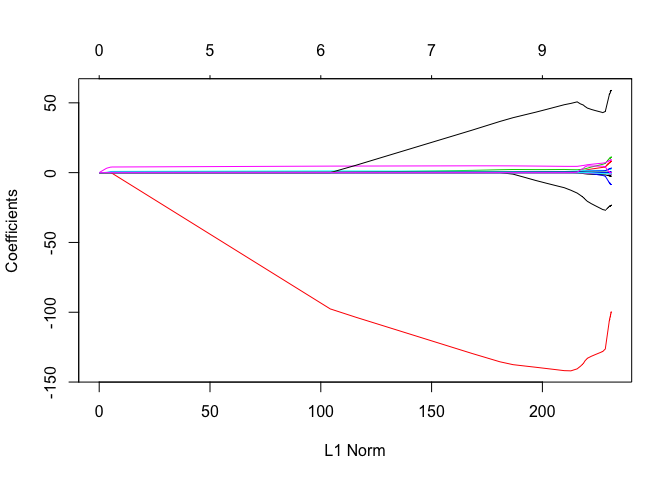

Linear Model Selection and Regularization
================
Fan Gong
2017/8/6

Linear Model Selection and Regularization
=========================================

Overview
--------

We would like to use another fitting procedure instead of least squares, because alternative fitting procedures can yield better prediction accuracy and model interpretability.

We will discuss three important classes of methods:

-   Subset Selection: This approach involves identifying a subset of the p predictors that we believe to be related to the response.

-   Shrinkage (regularization): This approach involves fitting a model involving all p predictors. However, the estimated coefficients are shrunken towards zero relative to the least squares estimates.

-   Dimension Reduction : This approach involves projecting the p predictors into a M-dimensional subspace, where M &lt; p.

Subset Selection
----------------

### Best Subset Selection

To perform best subset selection, we fit a separate least squares regression for each possible combination of the p predictors.

#### Implementation in R

`regsubsets()` function in `leaps` library could perform best subset selection by identifying the best model that contains a given number of predictors, where best is quantified using RSS.

``` r
#Data Pre-processing
library(ISLR)
names(Hitters)
```

    ##  [1] "AtBat"     "Hits"      "HmRun"     "Runs"      "RBI"      
    ##  [6] "Walks"     "Years"     "CAtBat"    "CHits"     "CHmRun"   
    ## [11] "CRuns"     "CRBI"      "CWalks"    "League"    "Division" 
    ## [16] "PutOuts"   "Assists"   "Errors"    "Salary"    "NewLeague"

``` r
Hitters = na.omit(Hitters)
dim(Hitters)
```

    ## [1] 263  20

``` r
#Best Subset Selection
##By default, regsubsets only reports results up to eight variable.
library(leaps)
library(ggplot2)
regfit.full = regsubsets(Salary~., data = Hitters, nvmax = 6)
summary(regfit.full)
```

    ## Subset selection object
    ## Call: regsubsets.formula(Salary ~ ., data = Hitters, nvmax = 6)
    ## 19 Variables  (and intercept)
    ##            Forced in Forced out
    ## AtBat          FALSE      FALSE
    ## Hits           FALSE      FALSE
    ## HmRun          FALSE      FALSE
    ## Runs           FALSE      FALSE
    ## RBI            FALSE      FALSE
    ## Walks          FALSE      FALSE
    ## Years          FALSE      FALSE
    ## CAtBat         FALSE      FALSE
    ## CHits          FALSE      FALSE
    ## CHmRun         FALSE      FALSE
    ## CRuns          FALSE      FALSE
    ## CRBI           FALSE      FALSE
    ## CWalks         FALSE      FALSE
    ## LeagueN        FALSE      FALSE
    ## DivisionW      FALSE      FALSE
    ## PutOuts        FALSE      FALSE
    ## Assists        FALSE      FALSE
    ## Errors         FALSE      FALSE
    ## NewLeagueN     FALSE      FALSE
    ## 1 subsets of each size up to 6
    ## Selection Algorithm: exhaustive
    ##          AtBat Hits HmRun Runs RBI Walks Years CAtBat CHits CHmRun CRuns
    ## 1  ( 1 ) " "   " "  " "   " "  " " " "   " "   " "    " "   " "    " "  
    ## 2  ( 1 ) " "   "*"  " "   " "  " " " "   " "   " "    " "   " "    " "  
    ## 3  ( 1 ) " "   "*"  " "   " "  " " " "   " "   " "    " "   " "    " "  
    ## 4  ( 1 ) " "   "*"  " "   " "  " " " "   " "   " "    " "   " "    " "  
    ## 5  ( 1 ) "*"   "*"  " "   " "  " " " "   " "   " "    " "   " "    " "  
    ## 6  ( 1 ) "*"   "*"  " "   " "  " " "*"   " "   " "    " "   " "    " "  
    ##          CRBI CWalks LeagueN DivisionW PutOuts Assists Errors NewLeagueN
    ## 1  ( 1 ) "*"  " "    " "     " "       " "     " "     " "    " "       
    ## 2  ( 1 ) "*"  " "    " "     " "       " "     " "     " "    " "       
    ## 3  ( 1 ) "*"  " "    " "     " "       "*"     " "     " "    " "       
    ## 4  ( 1 ) "*"  " "    " "     "*"       "*"     " "     " "    " "       
    ## 5  ( 1 ) "*"  " "    " "     "*"       "*"     " "     " "    " "       
    ## 6  ( 1 ) "*"  " "    " "     "*"       "*"     " "     " "    " "

``` r
#The procedure of variable selection from the full model
regfit.full = regsubsets(Salary~., data = Hitters, nvmax = 19)
reg.summary = summary(regfit.full)
names(reg.summary)
```

    ## [1] "which"  "rsq"    "rss"    "adjr2"  "cp"     "bic"    "outmat" "obj"

``` r
##Find the optimal model
par(mfrow =c(2,2))
##RSS
plot(reg.summary$rss ,xlab=" Number of Variables ",ylab="RSS", type="l")
##Adjusted R2
plot(reg.summary$adjr2 ,xlab =" Number of Variables ", ylab=" Adjusted RSq",type="l")
max = which.max(reg.summary$adjr2);max
```

    ## [1] 11

``` r
points(x = max, y = reg.summary$adjr2[max], col = "red", cex = 2, pch = 20)
##Cp
plot(reg.summary$cp ,xlab =" Number of Variables ", ylab="Cp", type="l")
min_cp = which.min(reg.summary$cp);min_cp
```

    ## [1] 10

``` r
points(x = min_cp, y = reg.summary$cp[min_cp], col = "red", cex = 2, pch = 20)
##BIC
plot(reg.summary$bic ,xlab =" Number of Variables ", ylab="BIC", type="l")
min_bic = which.min(reg.summary$bic);min_bic
```

    ## [1] 6

``` r
points(x = min_bic, y = reg.summary$cp[min_bic], col = "red", cex = 2, pch = 20)
```


``` r
##Use built-in plot in regsubsets
##The top row of each plot contains a black square for each variable selected according to the optimal model associated with that statistic
par(mfrow =c(1,2))
plot(regfit.full, scale = "r2")
plot(regfit.full, scale = "adjr2")
```


``` r
plot(regfit.full, scale = "Cp")
plot(regfit.full, scale = "bic")
```


### Stepwise Selection

For computational reasons, best subset selection cannot be applied with very large p. Stepwise methods, which explore a far more restricted set of models, are attractive alternatives to best subset selection.

#### Forward Stepwise Selection

-   Forward stepwise selection begins with a model containing no predictors, and then adds predictors to the model, one-at-a-time, until all of the predictors are in the model.

-   Forward stepwise selection is not guaranteed to yield the best model containing a subset of the p predictors, since it is a greedy algorithm.

-   Forward stepwise selection can be applied even in the high-dimensional setting where n &lt; p; however, in this case, it is possible to construct submodels M0, M1.. Mn-1 only, since each submodel is fit using least squares, which will not yield a unique solution if p &gt; n.

#### Backward Stepwise Selection

-   Backward stepwise selection begins with the full least squares model containing all p predictors, and then iteratively removes the least useful predictor, one-at-a-time.

-   Also, backward stepwise selection is not guaranteed to yield the best model.

-   Backward selection requires that the number of samples n is larger than the number of variables p (so that the full model can be fit).

##### Implementation in R

We can also use the `regsubsets()` function to perform forward stepwise or backward stepwise selection, using the argument `method = "forward"` or `method = "backward"`

``` r
regfit.fwd = regsubsets(Salary~., data = Hitters, nvmax = 19, method = "forward")
coef(regfit.fwd, 7)
```

    ##  (Intercept)        AtBat         Hits        Walks         CRBI 
    ##  109.7873062   -1.9588851    7.4498772    4.9131401    0.8537622 
    ##       CWalks    DivisionW      PutOuts 
    ##   -0.3053070 -127.1223928    0.2533404

``` r
regfit.bwd = regsubsets(Salary~., data = Hitters, nvmax = 19, method = "backward")
coef(regfit.bwd, 7)
```

    ##  (Intercept)        AtBat         Hits        Walks        CRuns 
    ##  105.6487488   -1.9762838    6.7574914    6.0558691    1.1293095 
    ##       CWalks    DivisionW      PutOuts 
    ##   -0.7163346 -116.1692169    0.3028847

#### Choosing the Optimal Model

We wish to choose a model with a low test error, there are two common approaches:

1.  Indirectly estimate test error by making an adjustment to the training error to account for the bias due to overfitting.

-   $C\_p = \\frac{1}{n}(RSS+2d\\hat{\\sigma}^2)$. The *C*<sub>*p*</sub> statistics adds a penalty of $2d\\hat{\\sigma}^2$ to the training RSS. If $\\hat{\\sigma}^2$ is unbiased estimate, then *C*<sub>*p*</sub> is an unbiased estimate of test MSE.
-   $AIC = \\frac{1}{n\\hat{\\sigma}^2}(RSS + 2d\\hat{\\sigma}^2)$. For least squares models, *C*<sub>*p*</sub> and *A**I**C* are proportional to each other.
-   $BIC = \\frac{1}{n}(RSS+log(n)d\\hat{\\sigma}^2)$. Since *l**o**g**n* &gt; 2 for any n &gt;7, the BIC statistics places a heavier penalty on models than *C*<sub>*p*</sub>, which means it tends to choose a more simple model.
-   $Adjusted\\quad R^2=1-\\frac{RSS/(n-d-1)}{TSS/n-1}$. The intuition behind it is that adding noise varibales leads to an increase in d, such variables will lead to an increase in $\\frac{RSS}{n-d-1}$, and consequently a decrease in the adjusted *R*<sup>2</sup>.

1.  Directly estimate the test error, using either a validation set approach or a cross-validation approach.

We can directly estimate the test error using the validation set and cross-validation methods. We can select a model using the one-standard-error rule. We first calculate the standard error of the estimated test MSE for each model size, and then select the smallest model for which the estimated test error is within one standard error of the lowest point on the curve. The rationale here is that if a set of models appear to be more or less equally good, then we might as well choose the simplest model.

##### Implementation in R

We will choose among models using the validation set approach and corss-validation. Since there is no `predict()` method for `regsubsets()`, we need to construct X matrix by using `model.matrix()` and loop through different models to calculate the prediction value.

###### Validation Set

``` r
set.seed(1)
train = sample(c(TRUE,FALSE), nrow(Hitters), replace = T)
test = (!train)

#Full model
regfit.best = regsubsets(Salary~., data = Hitters[train,], nvmax = 19)
#Test X matrix 
test.mat = model.matrix(Salary~., data = Hitters[test,])
#Test error vector
val.errors = rep(NA, 19)
for(i in 1:19){
  coefi = coefficients(regfit.best, id = i)
  pred = test.mat[,names(coefi)] %*% coefi
  val.errors[i] = mean((Hitters$Salary[test] - pred)^2)
}
val.errors
```

    ##  [1] 220968.0 169157.1 178518.2 163426.1 168418.1 171270.6 162377.1
    ##  [8] 157909.3 154055.7 148162.1 151156.4 151742.5 152214.5 157358.7
    ## [15] 158541.4 158743.3 159972.7 159859.8 160105.6

``` r
#Variable selection
which.min(val.errors)
```

    ## [1] 10

###### Cross-Validation

``` r
#Ten folds CV
##(i,j)th element corresponds to the test MSE for the ith cv fold for the best j-variable model.
k = 10
folds = sample(1:k, nrow(Hitters), replace = T)
cv.errors = matrix(NA, k, 19, dimnames = list(NULL, paste(1:19)))
for(j in 1:k){
  best.fit = regsubsets(Salary~., data = Hitters[folds != j,], nvmax = 19)
  for(i in 1:19){
    test.mat = model.matrix(Salary~., data = Hitters[folds == j,])
    coefi = coefficients(best.fit, id = i)
    pred = test.mat[, names(coefi)] %*% coefi
    cv.errors[j,i] = mean((Hitters$Salary[folds == j] - pred)^2)
  }
}

#Average over the columns
mean.cv.errors = apply(cv.errors, 2, mean)
plot(mean.cv.errors, type = "b")
```


``` r
#The variable we choose
coefficients(regsubsets(Salary~., data = Hitters, nvmax = 19), id = 11)
```

    ##  (Intercept)        AtBat         Hits        Walks       CAtBat 
    ##  135.7512195   -2.1277482    6.9236994    5.6202755   -0.1389914 
    ##        CRuns         CRBI       CWalks      LeagueN    DivisionW 
    ##    1.4553310    0.7852528   -0.8228559   43.1116152 -111.1460252 
    ##      PutOuts      Assists 
    ##    0.2894087    0.2688277

Shrinkage Methods
-----------------

The two best-known techniques for shrinking the regression coefficients towards zero are ridge regression and the lasso.

### Ridge Regression

Ridge Regression is very similar to least squares, except that the coefficients are estimated by minimizing:

$\\sum\_1^n(y\_i-\\beta\_0-\\sum\_{j=1}^p\\beta\_jx\_{ij})^2+\\lambda\\sum\_{j=1}^p\\beta\_j^2=RSS+\\lambda\\sum\_{j=1}^p\\beta\_j^2$

Where *λ* ≥ 0 is a tunning parameter. This equation trades off two different criteria. As with least squares, ridge regression seeks coefficient estimates that fit the data well, by makeing the RSS small. However, the second term, $\\lambda\\sum\_{j=1}^p\\beta\_j^2$, called a shrinkage penalty, is small when *β*<sub>1</sub>, …, *β*<sub>*p*</sub> are close to zero. The tunning parameter serves to control the relative impact of these two terms.

Ridge regression???s advantage over least squares is rooted in the bias-variance trade-off. As ?? increases, the flexibility of the ridge regression fit decreases, leading to decreased variance but increased bias.

Ridge regression does have one obvious disadvantage. Unlike best subset, forward stepwise, and backward stepwise selection, which will generally select models that involve just a subset of the variables, ridge regression will include all p predictors in the final model.

#### Implementation in R

The `glmnet()` function has an `alpha` argument that determines what type of model is fit. If `alpha = 0` then a ridge regression model is fit, and if `alpha = 1`, then a lasso is fit.

One more thing need to notice is that here `predict()` function has different function when change the `type` argument. It is a little bit differnt from `predict.lm()`. More detailed information is included here: [link](https://www.rdocumentation.org/packages/glmnet/versions/2.0-10/topics/predict.glmnet)

``` r
library(glmnet)
#x, y must be a matrix(exclude intercept) 
x = model.matrix(Salary~., Hitters)[,-1]
y = Hitters$Salary

set.seed(1)
train = sample(1:nrow(x), nrow(x)/2)
test = (-train)
y.test = y[test]

#Use Cross-Validation to choose the optimal lambda
set.seed(1)
cv.out = cv.glmnet(x[train,], y[train], alpha = 0)
plot(cv.out)
```


``` r
bestlam = cv.out$lambda.min; bestlam
```

    ## [1] 211.7416

``` r
#Test error 
out = glmnet(x[train,], y[train], alpha = 0)
ridge.pred = predict(out, s = bestlam, newx = x[test,])
mean((ridge.pred - y.test)^2)
```

    ## [1] 95982.96

``` r
#Final Model
predict(out, type = "coefficients", s = bestlam)[1:20,]
```

    ##   (Intercept)         AtBat          Hits         HmRun          Runs 
    ##   70.05311157   -0.02693070    0.50987564    2.66229738    0.66230740 
    ##           RBI         Walks         Years        CAtBat         CHits 
    ##    0.83389930    3.18175160   -3.53224642    0.00970951    0.05925223 
    ##        CHmRun         CRuns          CRBI        CWalks       LeagueN 
    ##    0.14064206    0.15435313    0.06246763    0.09509983   38.37747314 
    ##     DivisionW       PutOuts       Assists        Errors    NewLeagueN 
    ## -112.57962395    0.25495550    0.05783169   -0.45677146   22.13460581

### The Lasso

The lasso is a relatively recent alternative to ridge regression that over comes the disadvantage ridge has. The lasso coefficients try to minimize the quantity:

$\\sum\_{i=1}^{n}(y\_i-\\beta\_0-\\sum\_{j=1}^p\\beta\_jx\_{ij})^2+\\lambda\\sum\_{j=1}^{p}|\\beta\_j|=RSS+\\lambda\\sum\_{j=1}^p|\\beta\_j|$

In the case of lasso, the *l*<sub>1</sub> penalty has the effect of forcing some of the coefficient estimates to be exactly equal to zero when the tuning parameter *λ* is sufficiently large. Hense, the lasso performs variable selection.

#### Implementation in R

``` r
#The function of variable selection
##We could see that some of the coefficients will be exactly equal to zero.
lasso.mod =glmnet (x[train,], y[train],alpha = 1)
plot(lasso.mod)
```



``` r
#Use cross-validation to choose the optimal lambda
set.seed(1)
cv.out = cv.glmnet(x[train,], y[train], alpha = 1)
bestlam = cv.out$lambda.min; bestlam
```

    ## [1] 16.78016

``` r
#Test error
lasso.pred = predict(lasso.mod, s = bestlam, newx = x[test,])
mean((lasso.pred-y.test)^2)
```

    ## [1] 100838.2

``` r
#Variable selection
out = glmnet(x, y, alpha = 1)
lasso.coef = predict(out, type = "coefficients", s = bestlam)[1:20,]; lasso.coef
```

    ##  (Intercept)        AtBat         Hits        HmRun         Runs 
    ##   19.5223994    0.0000000    1.8701714    0.0000000    0.0000000 
    ##          RBI        Walks        Years       CAtBat        CHits 
    ##    0.0000000    2.2187934    0.0000000    0.0000000    0.0000000 
    ##       CHmRun        CRuns         CRBI       CWalks      LeagueN 
    ##    0.0000000    0.2072852    0.4127984    0.0000000    1.7591971 
    ##    DivisionW      PutOuts      Assists       Errors   NewLeagueN 
    ## -103.5051402    0.2206884    0.0000000    0.0000000    0.0000000

``` r
lasso.coef[lasso.coef!=0]
```

    ##  (Intercept)         Hits        Walks        CRuns         CRBI 
    ##   19.5223994    1.8701714    2.2187934    0.2072852    0.4127984 
    ##      LeagueN    DivisionW      PutOuts 
    ##    1.7591971 -103.5051402    0.2206884

### Comparison of Lasso and Ridge Regression

In general, one might expect the lasso to perform better in a setting where a relatively small number of predictors have substantial coeffecients, and the remaining predictors have coefficients that are very small or that equal zero. Ridge regression will perform better when the response is a function of many predictors, all with coefficients of roughly equal size.

Dimension Reduction Methods
---------------------------

We now explore a class of approaches that transform the predictors and then fit a least squares model using the transformed variables.

Let *Z*<sub>1</sub>, *Z*<sub>2</sub>, …, *Z*<sub>*M*</sub> represent *M* &lt; *p* linear combinations of our original p predictors. That is,
$$Z\_m=\\sum\_{j=1}^p\\phi\_{jm}X\_j$$

We can then fit the linear regression model:
$$y\_i=\\theta\_0+\\sum\_{m=1}^M\\theta\_mz\_{im}+\\epsilon\_i$$

using least squares.

The choice of *Z*<sub>1</sub>, *Z*<sub>2</sub>, …, *Z*<sub>*M*</sub>, or equivalently, the selection of the *ϕ*<sub>*j**m*</sub>'s, can be achieved in different ways. We will consider two approaches for this task: principal components and partial least squares.

### Principal Components Regression

Here I ignore the introduction of PCA since I will talk about it in details later.

In PCR, the number of principal components, M, is typically chosen by cross-validation. When performing PCR, we generally recommend standardizing each predictor prior to generating the principal components. This standardization ensures that all variables are on the same scale.

PCR suffers from a drawback: there is no guarantee that the directions that best explain the predictors will also be the best directions to use for predicting the response.

#### Implementation in R

PCR can be performed using the `pcr()` function, which is part of the `pls` library.

``` r
library(pls)
set.seed(1)
#Perform PCR
pcr.fit = pcr(Salary~., data = Hitters[train,] ,scale = T, validation = "CV")

#Find the optimal number of PC
summary(pcr.fit)
```

    ## Data:    X dimension: 131 19 
    ##  Y dimension: 131 1
    ## Fit method: svdpc
    ## Number of components considered: 19
    ## 
    ## VALIDATION: RMSEP
    ## Cross-validated using 10 random segments.
    ##        (Intercept)  1 comps  2 comps  3 comps  4 comps  5 comps  6 comps
    ## CV           464.6    406.1    397.1    399.1    398.6    395.2    386.9
    ## adjCV        464.6    405.2    396.3    398.1    397.4    394.5    384.5
    ##        7 comps  8 comps  9 comps  10 comps  11 comps  12 comps  13 comps
    ## CV       384.8    386.5    394.1     406.1     406.5     412.3     407.7
    ## adjCV    383.3    384.8    392.0     403.4     403.7     409.3     404.6
    ##        14 comps  15 comps  16 comps  17 comps  18 comps  19 comps
    ## CV        406.2     417.8     417.6     413.0     407.0     410.2
    ## adjCV     402.8     413.9     413.5     408.3     402.4     405.5
    ## 
    ## TRAINING: % variance explained
    ##         1 comps  2 comps  3 comps  4 comps  5 comps  6 comps  7 comps
    ## X         38.89    60.25    70.85    79.06    84.01    88.51    92.61
    ## Salary    28.44    31.33    32.53    33.69    36.64    40.28    40.41
    ##         8 comps  9 comps  10 comps  11 comps  12 comps  13 comps  14 comps
    ## X         95.20    96.78     97.63     98.27     98.89     99.27     99.56
    ## Salary    41.07    41.25     41.27     41.41     41.44     43.20     44.24
    ##         15 comps  16 comps  17 comps  18 comps  19 comps
    ## X          99.78     99.91     99.97    100.00    100.00
    ## Salary     44.30     45.50     49.66     51.13     51.18

``` r
validationplot(pcr.fit, val.type="MSEP")
```


``` r
#Test error
pcr.pred = predict(pcr.fit, x[test,], ncomp = 7)
mean((pcr.pred - y.test)^2)
```

    ## [1] 96556.22

``` r
#Fit the full model
pcr.fit = pcr(y~x, scale = T, ncomp = 7)
summary(pcr.fit)
```

    ## Data:    X dimension: 263 19 
    ##  Y dimension: 263 1
    ## Fit method: svdpc
    ## Number of components considered: 7
    ## TRAINING: % variance explained
    ##    1 comps  2 comps  3 comps  4 comps  5 comps  6 comps  7 comps
    ## X    38.31    60.16    70.84    79.03    84.29    88.63    92.26
    ## y    40.63    41.58    42.17    43.22    44.90    46.48    46.69

### Partial Least Squares

We now present partial least squares, a supervised alternative to PCR.Roughly speaking, the PLS approach attempts to find directions that help explain both the response and the predictors.

We now describe how the first PLS direction is computed. After standardizing the p predictors, PLS computes the first direction *Z*<sub>1</sub> by setting each *ϕ*<sub>*j*1</sub> equal to the coefficient from the simple linear regression of *Y* onto *X*<sub>*j*</sub>. One can show that this coefficient is proportional to the correlation between *Y* and *X*<sub>*j*</sub>. Hence, in computing $Z\_1 = \\sum\_{j=1}^{p}\\phi\_{j1}X\_j$, PLS places the highest weight on the variables that are most strongly related to the response.

To identify the second PLS direction we first adjust each of the variables for *Z*<sub>1</sub>, by regressing each variable on *Z*<sub>1</sub> and taking residuals. These residuals can be interpreted as the remaining information that has not been explained by the first PLS direction. We then compute *Z*<sub>2</sub> using this orthogonalized data in exactly the same fashion as *Z*<sub>1</sub> was computed based on the original data. This iterative approach can be repeated M times to identify multiple PLS components. Fianlly we use least squares to fit a linear model to predict *Y* using *Z*<sub>1</sub>, …, *Z*<sub>*M*</sub>.

As with PCR, the number M of partial least squares directions used in PLS is a tuning parameter that is typically chosen by cross-validation.

#### Implementation in R

``` r
set.seed(1)
#Perform PLS
pls.fit = plsr(Salary~., data = Hitters[train,], scale = T, validation = "CV")

#Find the optimal components
summary(pls.fit)
```

    ## Data:    X dimension: 131 19 
    ##  Y dimension: 131 1
    ## Fit method: kernelpls
    ## Number of components considered: 19
    ## 
    ## VALIDATION: RMSEP
    ## Cross-validated using 10 random segments.
    ##        (Intercept)  1 comps  2 comps  3 comps  4 comps  5 comps  6 comps
    ## CV           464.6    394.2    391.5    393.1    395.0    415.0    424.0
    ## adjCV        464.6    393.4    390.2    391.1    392.9    411.5    418.8
    ##        7 comps  8 comps  9 comps  10 comps  11 comps  12 comps  13 comps
    ## CV       424.5    415.8    404.6     407.1     412.0     414.4     410.3
    ## adjCV    418.9    411.4    400.7     402.2     407.2     409.3     405.6
    ##        14 comps  15 comps  16 comps  17 comps  18 comps  19 comps
    ## CV        406.2     408.6     410.5     408.8     407.8     410.2
    ## adjCV     401.8     403.9     405.6     404.1     403.2     405.5
    ## 
    ## TRAINING: % variance explained
    ##         1 comps  2 comps  3 comps  4 comps  5 comps  6 comps  7 comps
    ## X         38.12    53.46    66.05    74.49    79.33    84.56    87.09
    ## Salary    33.58    38.96    41.57    42.43    44.04    45.59    47.05
    ##         8 comps  9 comps  10 comps  11 comps  12 comps  13 comps  14 comps
    ## X         90.74    92.55     93.94     97.23     97.88     98.35     98.85
    ## Salary    47.53    48.42     49.68     50.04     50.54     50.78     50.92
    ##         15 comps  16 comps  17 comps  18 comps  19 comps
    ## X          99.11     99.43     99.78     99.99    100.00
    ## Salary     51.04     51.11     51.15     51.16     51.18

``` r
validationplot(pls.fit, val.type = "MSEP")
```


``` r
#Test error
pls.pred = predict(pls.fit, x[test,], ncomp = 2)
mean((pls.pred - y.test)^2)
```

    ## [1] 101417.5

``` r
#Fit the full model
pls.fit = plsr(Salary~., data = Hitters, scale = T, validation = "CV", ncomp = 2)
summary(pls.fit)
```

    ## Data:    X dimension: 263 19 
    ##  Y dimension: 263 1
    ## Fit method: kernelpls
    ## Number of components considered: 2
    ## 
    ## VALIDATION: RMSEP
    ## Cross-validated using 10 random segments.
    ##        (Intercept)  1 comps  2 comps
    ## CV             452    349.0    346.4
    ## adjCV          452    348.6    345.7
    ## 
    ## TRAINING: % variance explained
    ##         1 comps  2 comps
    ## X         38.08    51.03
    ## Salary    43.05    46.40

``` r
##Notice that the percentage of variance in Salary that the two-component PLS fit explains, 46.40%, is almost as much as that explained using the final seven-component model PCR fit, 46.69 %. This is because PCR only attempts to maximize the amount of variance explained in the predictors, while PLS searches for directions that explain variance in both the predictors and the response.
```
