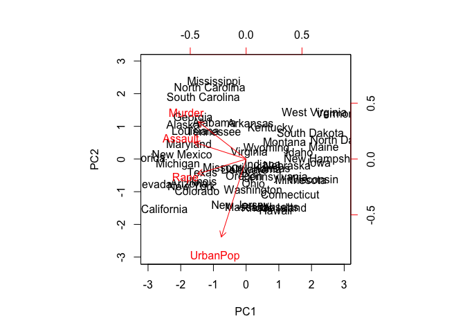
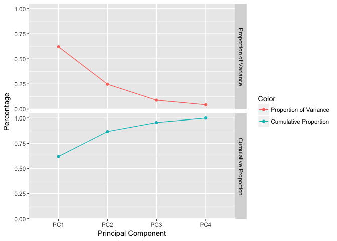

PCA
================
Fan Gong
2017/7/16

What Are Principal Components
=============================

PCA finds a low-dimensional representation of a data set that contains as much as possible of the variation. Each of the dimensions found by PCA is a linear combination of the p features.

Basic Concepts and Math Theory
------------------------------

The first PC of a set of features *X*<sub>1</sub>, *X*<sub>2</sub>, ..., *X*<sub>*p*</sub> is the normalized linear combination of the features:*Z*<sub>1</sub> = *ϕ*<sub>11</sub>*X*<sub>1</sub> + *ϕ*<sub>21</sub>*X*<sub>2</sub> + ... + *ϕ*<sub>*p*1</sub>*X*<sub>*p*</sub> that has the largest variance. By **normalized**, we mean $\\sum\_{j=1}^{p}\\phi\_{j1}^{2}=1$. We refer to the elements *ϕ*<sub>11</sub>, ..., *ϕ*<sub>*p*1</sub> as the **loadings**.

Given a *n* × *p* data set *X*, we need to center *X* to have mean zero in every column, otherwise the column which has large absolute value will give much weight in first PC. Then we look for the linear combination of the sample feature values of the form:

*z*<sub>*i*1</sub> = *ϕ*<sub>11</sub>*x*<sub>*i*1</sub> + *ϕ*<sub>21</sub>*x*<sub>*i*2</sub> + … + *ϕ*<sub>*p*1</sub>*x*<sub>*i**p*</sub> subject to $\\sum\_{j=1}^p\\phi\_{j1}^2=1$. In other words, the frst PC loading vector solves the optimization problem that maximize the sum of variance: $maximize\\{\\frac{1}{n}\\sum\_{i=1}^{n}(\\sum\_{j=1}^p\\phi\_{j1}x\_{ij})^2\\}$ subject to $\\sum\_{j=1}^{p}\\phi\_{j1}^{2}=1$. This equals to maximize $\\frac{1}{n}\\sum\_{i=1}^{n}z\_{i1}^2$. Hence the objective that we are maximizing is just the sample variance of the n values of *z*<sub>*i*1</sub>. We refer to *z*<sub>11</sub>, …, *z*<sub>*n*1</sub> as the **scores** of the first PC.

The sceond PC is the linear combinations that are *uncorrelated* with *Z*<sub>1</sub>.

Once we have computed the principal components, we can plot them against each other in order to produce low-dimensional views of the data.

Another interpretation of PC
----------------------------

The first PC loading vector has a very special property: it is the line in p-dimentsional space that is closest to the n observations. Using this interpretation, together the first M principal component score vectors and the first M PC loading vectors provide the best M-dimensional approximation.

More on PCA
-----------

### Scaling the Variables

Because the variables are measured in different units, if we perform PCA on the unscaled variables, then the first PC loading vector will have a very large loading for the variable which has a large absolute value and large variance. But if the variables are measured in the same units, we might choose not to scale the variable to each have std one. \#\#\#The Proportion of Variance Explained(PVE) The **total variance** present in a data set is defined as $\\sum\_{j=1}^pVar(X\_j)=\\sum\_{j}^p\\frac{1}{n}\\sum\_{i=1}^{n}x\_{ij}^2$ and the **variance explained** by the mth PC is $\\frac{1}{n}\\sum\_{i=1}^nz\_{im}^2$, so the PVE of the mth PC is given by:

$\\frac{\\frac{1}{n}\\sum\_{i=1}^nz\_{im}^2}{\\sum\_{j=1}^pVar(X\_j)=\\sum\_{j}^p\\frac{1}{n}\\sum\_{i=1}^{n}x\_{ij}^2}$

### Deciding How Many PC to Use

We tend to look at the first few principal components in order to find interesting patterns in the data. If no interesting patterns are found in the first few principal components, then further principal components are unlikely to be of interest.

Use R to implement PCA
======================

``` r
#We perform PCA on the USArrests data set
pr.out = prcomp(USArrests, scale = T )

#The center and scale components correspond to the means and std prior scaling
pr.out$center
```

    ##   Murder  Assault UrbanPop     Rape 
    ##    7.788  170.760   65.540   21.232

``` r
pr.out$scale
```

    ##    Murder   Assault  UrbanPop      Rape 
    ##  4.355510 83.337661 14.474763  9.366385

``` r
#The rotation matrix provides the principal components loadings
pr.out$rotation
```

    ##                 PC1        PC2        PC3         PC4
    ## Murder   -0.5358995  0.4181809 -0.3412327  0.64922780
    ## Assault  -0.5831836  0.1879856 -0.2681484 -0.74340748
    ## UrbanPop -0.2781909 -0.8728062 -0.3780158  0.13387773
    ## Rape     -0.5434321 -0.1673186  0.8177779  0.08902432

``` r
#The PC score vectors. The kth column is the kth PC score vector.
pr.out$x
```

    ##                        PC1         PC2         PC3          PC4
    ## Alabama        -0.97566045  1.12200121 -0.43980366  0.154696581
    ## Alaska         -1.93053788  1.06242692  2.01950027 -0.434175454
    ## Arizona        -1.74544285 -0.73845954  0.05423025 -0.826264240
    ## Arkansas        0.13999894  1.10854226  0.11342217 -0.180973554
    ## California     -2.49861285 -1.52742672  0.59254100 -0.338559240
    ## Colorado       -1.49934074 -0.97762966  1.08400162  0.001450164
    ## Connecticut     1.34499236 -1.07798362 -0.63679250 -0.117278736
    ## Delaware       -0.04722981 -0.32208890 -0.71141032 -0.873113315
    ## Florida        -2.98275967  0.03883425 -0.57103206 -0.095317042
    ## Georgia        -1.62280742  1.26608838 -0.33901818  1.065974459
    ## Hawaii          0.90348448 -1.55467609  0.05027151  0.893733198
    ## Idaho           1.62331903  0.20885253  0.25719021 -0.494087852
    ## Illinois       -1.36505197 -0.67498834 -0.67068647 -0.120794916
    ## Indiana         0.50038122 -0.15003926  0.22576277  0.420397595
    ## Iowa            2.23099579 -0.10300828  0.16291036  0.017379470
    ## Kansas          0.78887206 -0.26744941  0.02529648  0.204421034
    ## Kentucky        0.74331256  0.94880748 -0.02808429  0.663817237
    ## Louisiana      -1.54909076  0.86230011 -0.77560598  0.450157791
    ## Maine           2.37274014  0.37260865 -0.06502225 -0.327138529
    ## Maryland       -1.74564663  0.42335704 -0.15566968 -0.553450589
    ## Massachusetts   0.48128007 -1.45967706 -0.60337172 -0.177793902
    ## Michigan       -2.08725025 -0.15383500  0.38100046  0.101343128
    ## Minnesota       1.67566951 -0.62590670  0.15153200  0.066640316
    ## Mississippi    -0.98647919  2.36973712 -0.73336290  0.213342049
    ## Missouri       -0.68978426 -0.26070794  0.37365033  0.223554811
    ## Montana         1.17353751  0.53147851  0.24440796  0.122498555
    ## Nebraska        1.25291625 -0.19200440  0.17380930  0.015733156
    ## Nevada         -2.84550542 -0.76780502  1.15168793  0.311354436
    ## New Hampshire   2.35995585 -0.01790055  0.03648498 -0.032804291
    ## New Jersey     -0.17974128 -1.43493745 -0.75677041  0.240936580
    ## New Mexico     -1.96012351  0.14141308  0.18184598 -0.336121113
    ## New York       -1.66566662 -0.81491072 -0.63661186 -0.013348844
    ## North Carolina -1.11208808  2.20561081 -0.85489245 -0.944789648
    ## North Dakota    2.96215223  0.59309738  0.29824930 -0.251434626
    ## Ohio            0.22369436 -0.73477837 -0.03082616  0.469152817
    ## Oklahoma        0.30864928 -0.28496113 -0.01515592  0.010228476
    ## Oregon         -0.05852787 -0.53596999  0.93038718 -0.235390872
    ## Pennsylvania    0.87948680 -0.56536050 -0.39660218  0.355452378
    ## Rhode Island    0.85509072 -1.47698328 -1.35617705 -0.607402746
    ## South Carolina -1.30744986  1.91397297 -0.29751723 -0.130145378
    ## South Dakota    1.96779669  0.81506822  0.38538073 -0.108470512
    ## Tennessee      -0.98969377  0.85160534  0.18619262  0.646302674
    ## Texas          -1.34151838 -0.40833518 -0.48712332  0.636731051
    ## Utah            0.54503180 -1.45671524  0.29077592 -0.081486749
    ## Vermont         2.77325613  1.38819435  0.83280797 -0.143433697
    ## Virginia        0.09536670  0.19772785  0.01159482  0.209246429
    ## Washington      0.21472339 -0.96037394  0.61859067 -0.218628161
    ## West Virginia   2.08739306  1.41052627  0.10372163  0.130583080
    ## Wisconsin       2.05881199 -0.60512507 -0.13746933  0.182253407
    ## Wyoming         0.62310061  0.31778662 -0.23824049 -0.164976866

``` r
#Plot the first two PC
##scale = 0 ensures that the arrows are scaled to represent the loadings.
biplot(pr.out, scale = 0)

#PVE(proportion of variance explained)
sm = summary(pr.out)
sm
```

    ## Importance of components:
    ##                           PC1    PC2     PC3     PC4
    ## Standard deviation     1.5749 0.9949 0.59713 0.41645
    ## Proportion of Variance 0.6201 0.2474 0.08914 0.04336
    ## Cumulative Proportion  0.6201 0.8675 0.95664 1.00000

``` r
#Plot the PVE explained by each component, as well as cumulative PVE
library(ggplot2)
```



``` r
library(reshape2)
data = sm$importance[-1,]
df = melt(data)

ggplot(data = df, aes(x = Var2, y = value, group = Var1, color = Var1)) + geom_line() + geom_point() + facet_grid(Var1~.) + xlab(" Principal Component ") + ylab("Percentage") + scale_color_discrete("Color")
```


