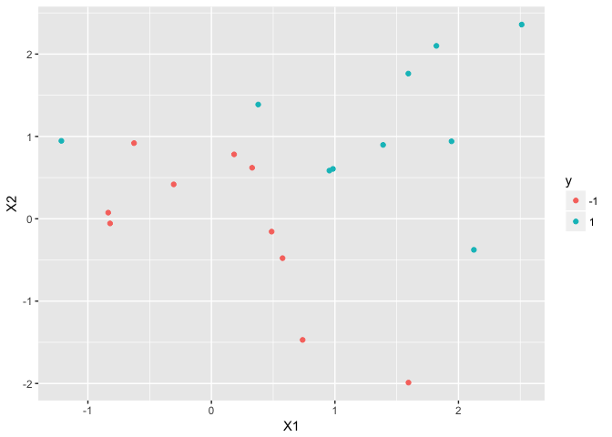
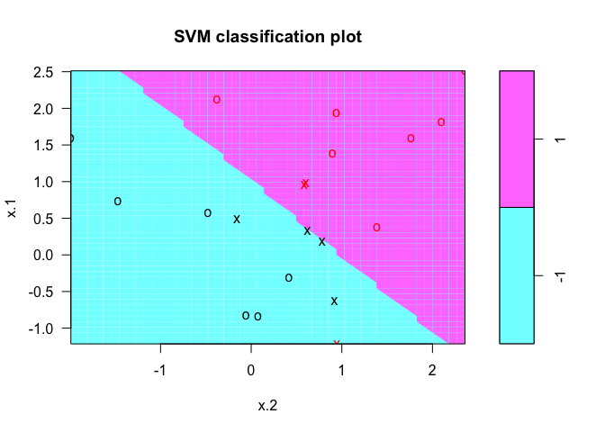
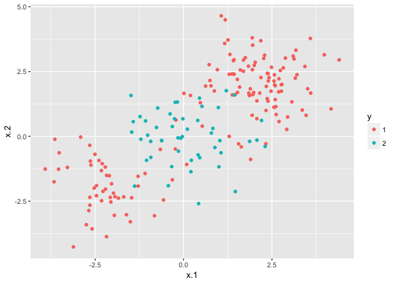
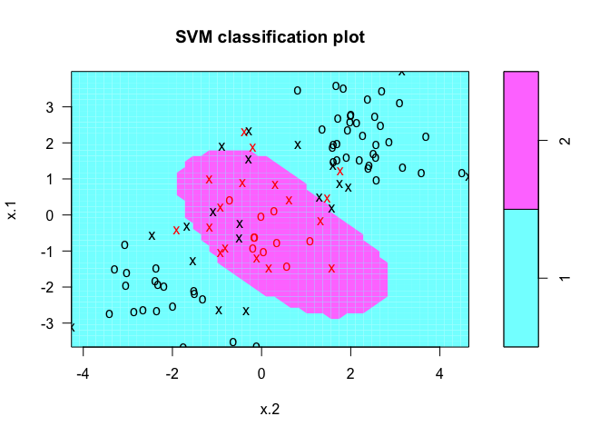
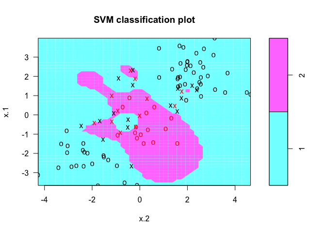
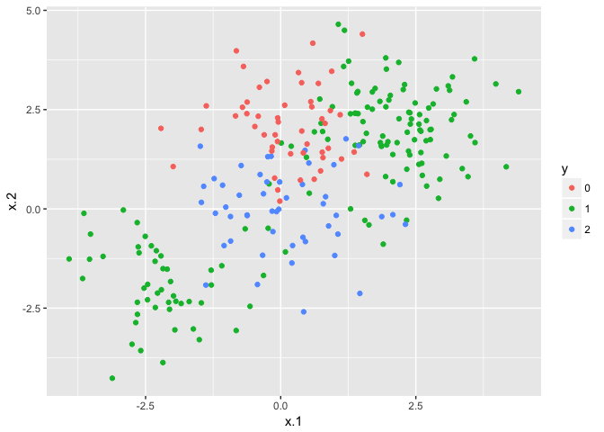
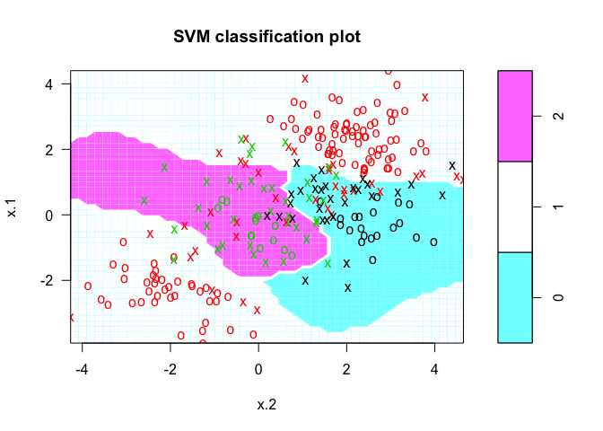

Support Vector Machine Review
================
Fan Gong
2017/7/20

Support Vector Machine
======================

Overview
--------

-   `Maximal Margin Classifier`: data can be perfectly seperated using a hyperplane. `MMC` maximizes the margin to seperate the data point and the observations lie outside the margin.

-   `Support Vector Classifier(soft margin classifier)`: The generalization of the maximal margin classifier to the non-separable case. The hyperplane is chosen to correctly separate most of the training observations into the two classes, but may misclassify a few observations

-   `Support Vector Machine`: enlarge the feature space by using `kernel` that leads to efficient computations to solve non-linear problems.

Maximal Margin Classifier
-------------------------

In general, if our data can be perfectly seperated using a hyperplane, then there will in fact exist an infinite number of such hyperplanes. A natural choice is the `maximal margin hyperplane`, which is the separating hyperplane that is farthest from the training observations. The observations that lie along the margin line are known as `support vectors`.

### Construction of Maximal Margin Classifier

suppose we have n training observations *x*<sub>1</sub>, …, *x*<sub>*n*</sub> and associated with class *y*<sub>1</sub>, …, *y*<sub>*n*</sub> ∈ { − 1, 1}. The optimization problem is:

$$
\\left\\{
\\begin{array}{l}
maximize\\,M\\quad (1)\\\\
subject\\, to \\sum\_{j=1}^{p}\\beta\_j^2=1\\quad(2)\\\\
y\_i(\\beta\_0+\\beta\_1x\_{i1}+\\dots+\\beta\_px\_{ip})\\ge M\\quad(3)\\\\
\\end{array}
\\right.
$$

the constraints (1)(2) ensure that each observation is on the correct side of the hyperplane and at least a distance M from the hyperplane.

Support Vector Classifiers(soft margin classifier)
--------------------------------------------------

In many cases no separating hyperplane exists, so there is no maximal margin classifier, so we need to use `soft margin`. The generalization of the maximal margin classifier to the non-separable case is known as the `support vector classifier`.

This time, we might be willing to consider a classifier based on a hyperplane that does not perfectly separate the two classes. We allow some observations to be on the incorrect side of the margin.

### Construction of Support Vector Classifier

The hyperplane is chosen to correctly separate most of the training observations into the two classes, but may misclassify a few observations. It is the solution to the optimization problem.

$$
\\left\\{
\\begin{array}{l}
maximize\\,M\\quad (1)\\\\
subject\\, to \\sum\_{j=1}^{p}\\beta\_j^2=1\\quad(2)\\\\
y\_i(\\beta\_0+\\beta\_1x\_{i1}+\\dots+\\beta\_px\_{ip})\\ge M(1-\\epsilon\_i)\\quad(3)\\\\
\\epsilon\_i\\ge0,\\sum\_{i=1}^n\\epsilon\_i\\le C\\quad(4)
\\end{array}
\\right.
$$
 Where *M* is the width of the margin, *C* is a nonnegative tuning parameter.*ϵ*<sub>*i*</sub> are slack variables that allow individual observations to be on the wrong side of the margin or the hyperplane.

If *ϵ*<sub>*i*</sub> &gt; 0 then the ith observation is on the wrong side of the margin; if*ϵ*<sub>*i*</sub> &gt; 1 then it is on the wrong side of the hyperplane.

We now consider the role of the tuning parameter C. C determines the number and severity of the violations to the margin that we will tolerate. If C = 0, then there is no budget for violations to the margin; For C &gt; 0, no more than C observations can be on the wrong side of the hyperplane. In pratice, C is treated as a tuning parameter that is generally chosen via cross-validation. C controls the bias-variance trade-off of the statistical learning technique.

Observations that lie directly on the margin, or on the wrong side of the margin for their class, are known as `support vectors`. These observations do affect the support vector classifier.

### Implementation in R

The `e1071` library contains implementations for a number of statistical learning methods. In particular, the `svm()` function can be used to fit a support vector classifier when the argument `kernek = 'linear'` is used. `cost` argument allows us to specify the cost of a violation to the margin. When the `cost` argument is small, then the margins will be wide and many support vectors will be on the margin or violate the margin.

``` r
library(e1071)
library(ggplot2)
#generating observations
set.seed(1)
x = matrix(rnorm(20 * 2), ncol = 2)
y = c(rep(-1, 10), rep(1, 10))
x[y==1,] = x[y==1,] + 1

#checking if the classes are linearly separable
ggplot(data = data.frame(x, y = as.factor(y)), aes(x = X1, y = X2, color = y)) + geom_point()
```



``` r
#fit the support vector classifier
dat = data.frame(x = x, y = as.factor(y))
svmfit = svm(y~., data = dat, kernel = 'linear', cost = 10, scale = F)
plot(svmfit, dat) #the support vectors are plotted as crosses and the remaining are plotted as circles.
```



``` r
#The support vectors
svmfit$index
```

    ## [1]  1  2  5  7 14 16 17

``` r
#Summary Information
summary(svmfit)
```

    ## 
    ## Call:
    ## svm(formula = y ~ ., data = dat, kernel = "linear", cost = 10, 
    ##     scale = F)
    ## 
    ## 
    ## Parameters:
    ##    SVM-Type:  C-classification 
    ##  SVM-Kernel:  linear 
    ##        cost:  10 
    ##       gamma:  0.5 
    ## 
    ## Number of Support Vectors:  7
    ## 
    ##  ( 4 3 )
    ## 
    ## 
    ## Number of Classes:  2 
    ## 
    ## Levels: 
    ##  -1 1

The `e1071` library includes a built-in function, `tune()`, to perform cross validation. By default, `tune()` performs ten-fold cross-validation.

``` r
set.seed(1)
tune.out = tune(svm, y~., data = dat, kernel = "linear", ranges = list(cost = c(0.001, 0.01, 0.1, 1, 5, 10, 100)))
summary(tune.out)
```

    ## 
    ## Parameter tuning of 'svm':
    ## 
    ## - sampling method: 10-fold cross validation 
    ## 
    ## - best parameters:
    ##  cost
    ##   0.1
    ## 
    ## - best performance: 0.1 
    ## 
    ## - Detailed performance results:
    ##    cost error dispersion
    ## 1 1e-03  0.70  0.4216370
    ## 2 1e-02  0.70  0.4216370
    ## 3 1e-01  0.10  0.2108185
    ## 4 1e+00  0.15  0.2415229
    ## 5 5e+00  0.15  0.2415229
    ## 6 1e+01  0.15  0.2415229
    ## 7 1e+02  0.15  0.2415229

``` r
bestmod = tune.out$best.model
summary(bestmod)
```

    ## 
    ## Call:
    ## best.tune(method = svm, train.x = y ~ ., data = dat, ranges = list(cost = c(0.001, 
    ##     0.01, 0.1, 1, 5, 10, 100)), kernel = "linear")
    ## 
    ## 
    ## Parameters:
    ##    SVM-Type:  C-classification 
    ##  SVM-Kernel:  linear 
    ##        cost:  0.1 
    ##       gamma:  0.5 
    ## 
    ## Number of Support Vectors:  16
    ## 
    ##  ( 8 8 )
    ## 
    ## 
    ## Number of Classes:  2 
    ## 
    ## Levels: 
    ##  -1 1

The `predict()` function can be used to predict the class label on a set of test observations, at any given value of the cost parameter.

``` r
set.seed(1)
xtest = matrix(rnorm(20 * 2), ncol = 2)
ytest = sample(c(-1,1), 20, replace = T)
xtest[ytest == 1,] = xtest[ytest == 1,] + 1
testdat = data.frame(x = xtest, y = as.factor(ytest))

ypred = predict(bestmod, testdat)
table(predict = ypred, truth = testdat$y)
```

    ##        truth
    ## predict -1  1
    ##      -1 10  1
    ##      1   1  8

Support Vector Machines
-----------------------

The support vector classifier is a natural approach for classification in the two-class setting, if the boundary between the two classes is linear. However, in practice we are sometimes faced with non-linear class boundaries. In that case, we consider enlarging the feature space using functions of the predictors, such as quadratic and cubic terms,in order to address this non-linearity.

In the case of the support vector classifier, we could address the problem of possibly non-linear boundaries between classes in a similar way. However, we could easily end up with a huge member of features. Then computations would become unmanageable. So, here we have SVM, The support vector machine allows us to enlarge the feature space in a way that leads to efficient computations.

### Construction of Support Vector Machine

The `support vector machine` is an extension of the support vector classifier that results from enlarging the feature space by `kernels`.

Briefly speaking, a `kernel` is a shortcut that helps us do certain calculation faster which otherwise would involve computations in higher dimensional space. Intuitively, a kernel is just a transformation of your input data that allows you to treat/process it more easily.

### Implementation in R

In order to fit an SVM using a non-linear kernel, we once again use the `svm()` function. However, now we use a different value of the parameter `kernel`. We could choose from `"polynomial"`, `"radial"` and so on. We also use the `degree` argument to specify a degree for the polynomial, and we use `gamma` to specify a value of *γ* for the radial basis kernel.

This time we generate data with a non-linear class boundary:

``` r
set.seed(1)
x = matrix(rnorm(200 * 2), ncol = 2)
x[1:100, ] = x[1:100, ] + 2
x[101:150, ] = x[101:150, ] - 2
y = c(rep(1,150), rep(2,50))
dat = data.frame(x = x, y = as.factor(y))
ggplot(data = dat, aes(x = x.1, y = x.2, color = y)) + geom_point()
```



The data is randomly split into training and testing groups. We then fit the training data using the `svm` function with a radial kernel and *γ* = 1

``` r
train = sample(200,100)
svmfit = svm(y ~., data = dat[train,], kernel = "radial", gamma = 1, cost = 1)
plot(svmfit, data = dat[train,])
```



``` r
#if we increase cost, training error will decrease, but easily get overfitting.
svmfit = svm(y ~., data = dat[train,], kernel = "radial", gamma = 1, cost = 10000)
plot(svmfit, data = dat[train,])
```



We then perform CV using `tune`

``` r
tune.out = tune(svm, y~., data = dat[train,], kernel = "radial", ranges = list(cost = c(0.1, 1, 10, 100, 1000), gamma = c(0.5, 1, 2,3,4)))
bestmodel = tune.out$best.model

result = predict(bestmodel, newdata = dat[-train,])
mean(result == dat[-train]$y)
```

    ## Warning in is.na(e2): is.na() applied to non-(list or vector) of type
    ## 'NULL'

    ## [1] NaN

SVMs with More Than Two Classes
-------------------------------

It turns that the concept of seperating hyperplanes upon which SVMs are based does not lend itself naturally to more than two classes.

### One-Versus-One Classification

Suppose we have *K* &gt; 2 classes. A `one-versus-one` or `all-pairs` approach constructs (<sub>2</sub><sup>*K*</sup>) SVMs, each of which compares a pair of classes. We classify a test observation using each of the (<sub>2</sub><sup>*K*</sup>) classifiers, and we tally the number of times that the test observation is assigned to each of the K classes. The final classification is performed by assigning the test observation to the class to which it was most frequently assigned in these pairwise classifications.

### One-Versus-All Classification

Each time comparing one the K classes to the remaining K-1 classes. Let *β*<sub>0*k*</sub>, *β*<sub>1*k*</sub>, …, *β*<sub>*p**k*</sub> denote the parameters that result from fitting an SVM comparing the kth class (coded as + 1) to the others (coded as -1). Let *x*<sup>\*</sup> denote a test observation. We assign the observation to the class for which *β*<sub>0*k*</sub> + *β*<sub>1*k*</sub>*x*<sub>1</sub><sup>\*</sup> + … + *β*<sub>*p**k*</sub>*x*<sub>*p*</sub><sup>\*</sup> is largest, as this amounts to a high level of confidence that the test observation belongs to the kth class rather than other classes.

### Implementation in R

If the response is a factor containing more than two levels, then the `svm()` fcuntion will perform multi-class classification using the one-versus-one approach.

``` r
set.seed(1)
x = rbind(x, matrix(rnorm(50*2), ncol = 2))
y = c(y, rep(0,50))
x[y==0,2] = x[y==0,2] + 2
dat = data.frame(x=x, y=as.factor(y))
ggplot(data = dat, aes(x = x.1, y = x.2, color = y)) + geom_point()
```



``` r
#fit svm
svmfit = svm(y~., data = dat, kernel = "radial", cost = 10, gamma = 1)
plot(svmfit, data = dat)
```


